# what is iam?

identity and access management(IAM) is web service that helps you securely control access to AWS resources for your users, you use IAM to control who can use
your AWS resources (authentication) and what resources the can use and in what ways (authorizatio).

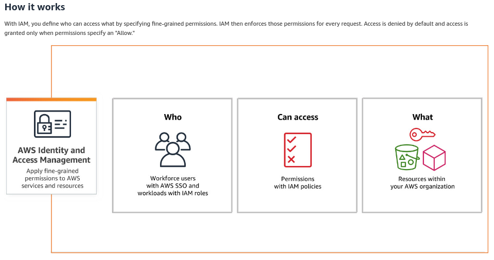

# components of iam?

```
1 USERS
2 GROUPS
3 ROLES
4 POLICIES
```

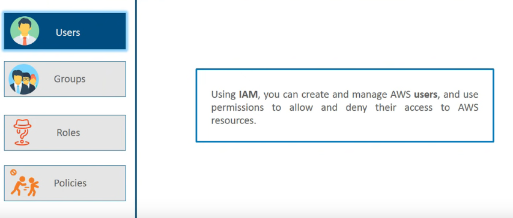

# multi factor authentication

# Group creation

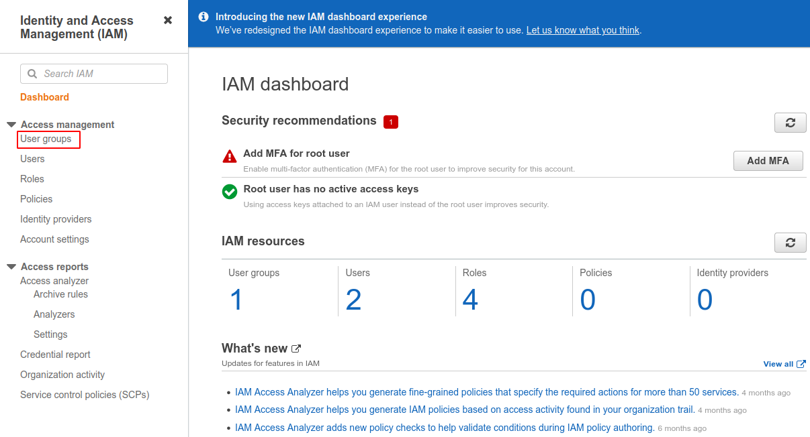

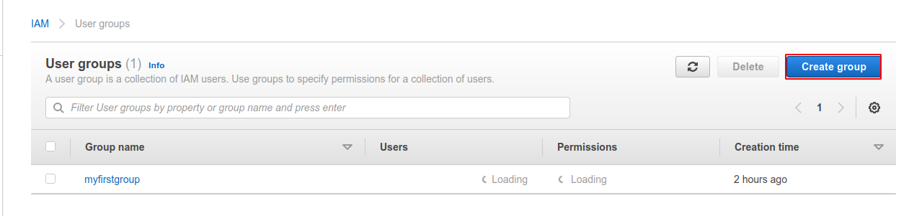

```
* Assing group name
* add users
* Attach permissions policies

```

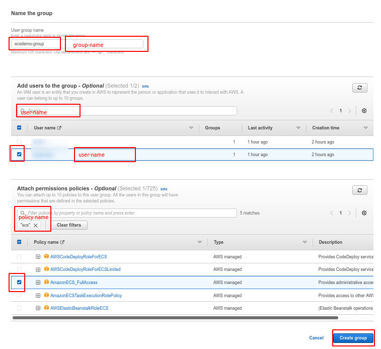

# User creation

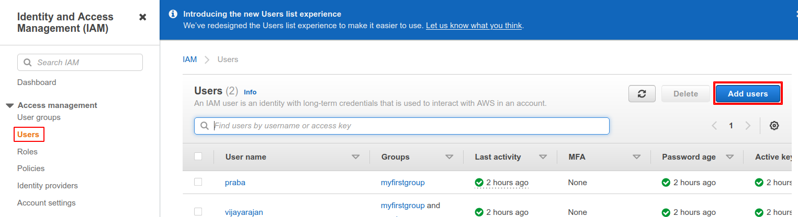

```
* Assing user name
* select aws access type
```

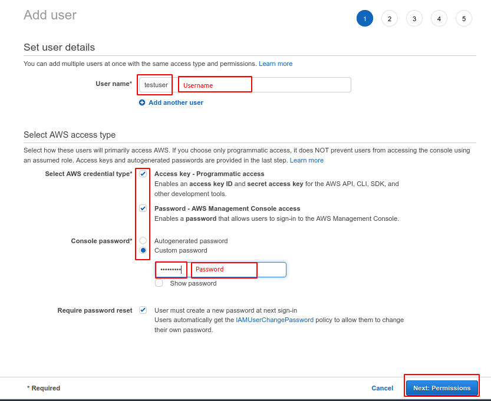

```
* select group name

```

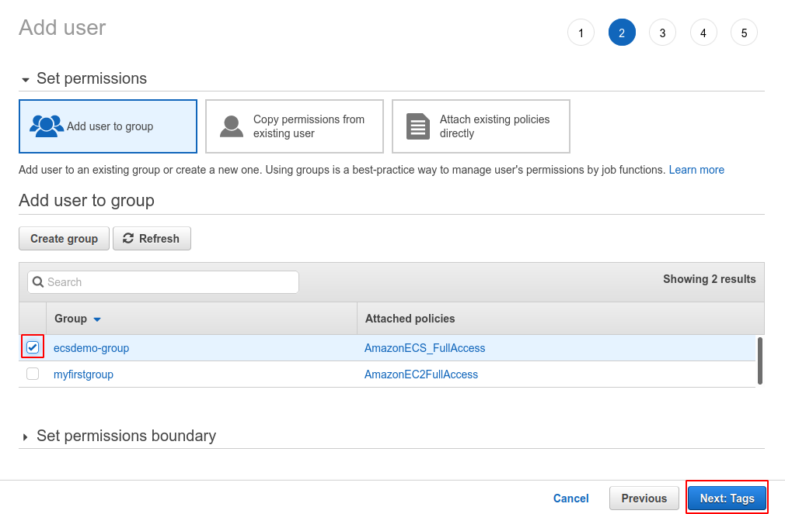

```
* Add user tags
```

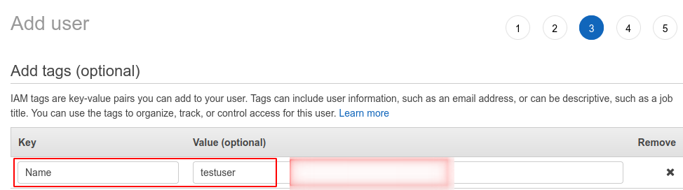

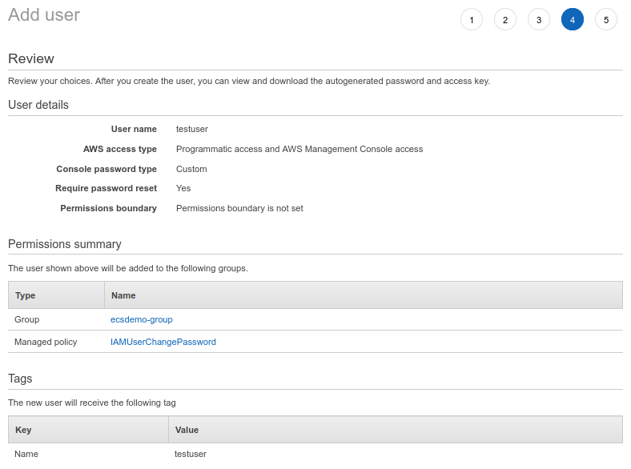

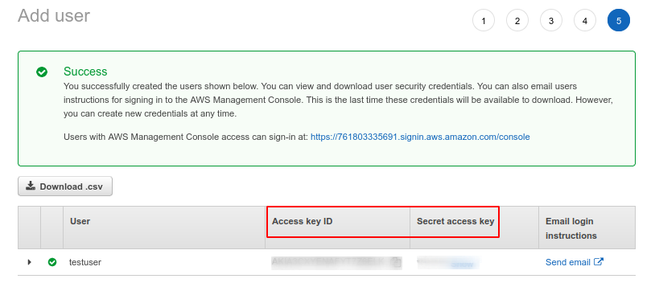
